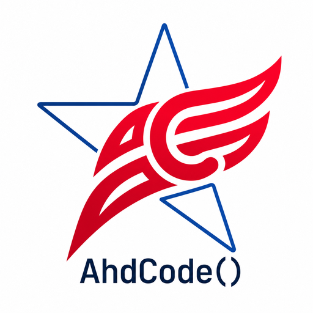
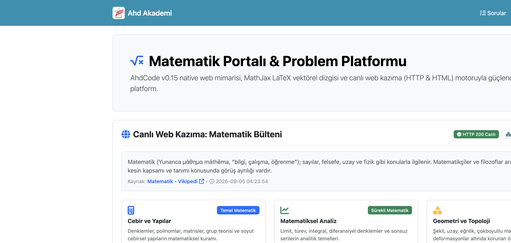
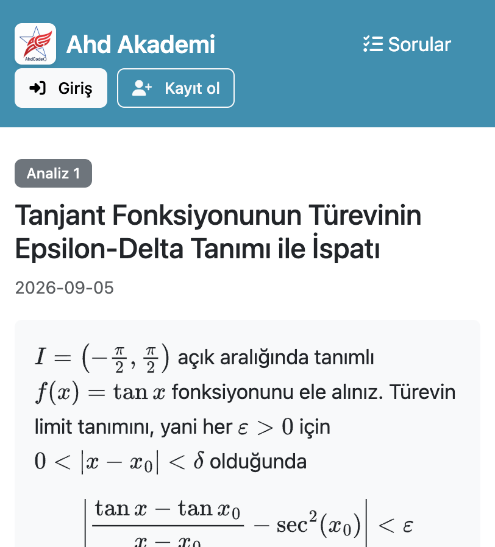
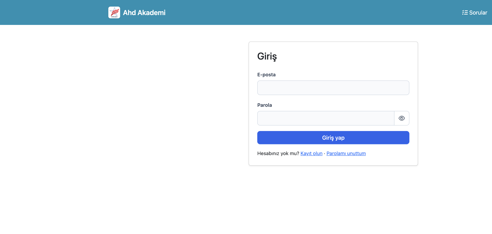
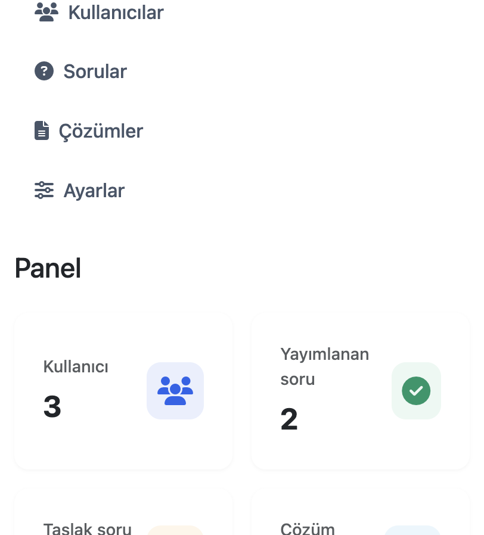
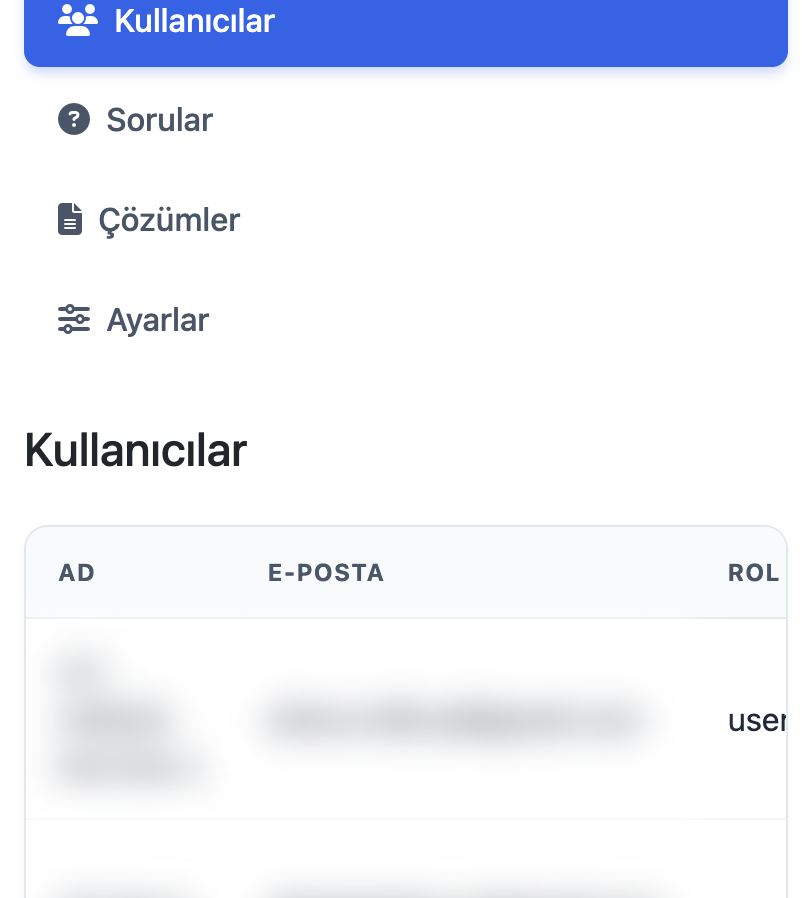

<p align="center">
  
</p>

<h1 align="center">Ahd Akademi Matematik</h1>

<p align="center">
  <strong>Built with <a href="https://github.com/aliharundaldalli/AhdCode">AhdCode</a> v0.15.0 — <a href="https://github.com/aliharundaldalli/AhdCode/releases/tag/v0.15.0">Web Foundations</a></strong>
</p>

<p align="center">
  <a href="https://github.com/aliharundaldalli/AhdCode"></a>
  <a href="https://github.com/aliharundaldalli/AhdCode/blob/main/docs/WEB.md"></a>
  <a href="https://github.com/aliharundaldalli/AhdCode/blob/main/docs/REQUIRE.md"></a>
  <a href="README_TR.md"></a>
</p>

A full-stack, server-rendered mathematics portal written entirely in AhdCode.
It is the reference dogfood application for **v0.15 Web Foundations**: `bring Web`,
`Web.UI`, Pages / Layouts / Components, `.env` + Config, and the same
`require(...)` composition introduced in v0.14.

There is no npm, Node, React, VDOM, ORM, or package registry. The compiler
bundles the Web framework. A built executable keeps no runtime dependency on
framework source.

[Türkçe](README_TR.md) · [AhdCode](https://github.com/aliharundaldalli/AhdCode) · [v0.15.0 release](https://github.com/aliharundaldalli/AhdCode/releases/tag/v0.15.0)

<p align="center">
  
</p>

## What v0.15 looks like in a real app

| AhdCode surface | How this portal uses it |
|---|---|
| `bring Web` / `Web.UI` | Semantic server-side HTML: forms, nav, tables, cards. Every text entry point escapes. |
| `require("...")` | One program split into Config, Repositories, Services, Layouts, Components, Pages |
| `ahdcode dev` | Watches the whole require graph and rebuilds on save |
| MySQL | Parameter-bound queries, InnoDB schema, UNIQUE constraints |
| Security | Argon2id passwords, CSRF with `secureEqual`, `session.rotate()` on login |
| HTTP + HTML | Live Wikipedia math bulletin (outbound client + scrape) |
| SMTP | Optional password-reset mail; generic response if mail is off |
| HTTP client + JSON | Optional Gemini draft helper; key never goes in a URL |
| `Server.static` | Local CSS/JS/images from `public/` only |

The public UI is Turkish. Math in questions is typeset with local MathJax.

<p align="center">
  
</p>

<p align="center">
  
</p>

<p align="center">
  
</p>

<p align="center">
  
</p>

## Layout

```
app.ahd                 entry: require(...) graph, routes, Server.static
Config/                 the only place that reads the environment
Support/                row helpers and validation
Repositories/           every SQL statement, bound parameters
Services/               auth, sessions, CSRF, uploads, mail, Gemini, scrape
Layouts/                Main, Auth, Admin shells
Components/             navbar, cards, forms, solution modal
Pages/                  one Function per route
public/                 Bootstrap CSS, app.css, logo, local scripts
storage/solutions/      private uploads — never mapped as static files
database/schema.sql     five InnoDB tables, IF NOT EXISTS
```

Every `require("...")` path is relative to this directory (the application
root), not to the file that wrote it. Each file brings the modules it uses.

## Requirements

- Installed **AhdCode v0.15.0** (`ahdcode --version`)
- A reachable MySQL server
- A writable private upload directory

Copy **`.env.example` → `.env`**. The example file has **empty** database,
SMTP, and Gemini values on purpose. Fill only your local `.env`. Never commit
`.env` or paste real passwords, API keys, or connection strings into the
example or the README.

```sh
ahdcode --version
cp .env.example .env   # only if .env does not already exist
chmod 600 .env
```

Process environment variables win over `.env`, including empty values.
`ahdcode build` embeds none of this: the executable reads configuration at
start-up.

Create the schema, then start the app:

```sql
CREATE DATABASE IF NOT EXISTS ahd_math_portal
  CHARACTER SET utf8mb4 COLLATE utf8mb4_unicode_ci;
```

```sh
mysql --host=127.0.0.1 --port=3306 --user=YOUR_USER -p ahd_math_portal < database/schema.sql
ahdcode dev app.ahd
```

Open [http://127.0.0.1:8160](http://127.0.0.1:8160).

There is **no default administrator**. Create one interactively:

```bash
read -r -p 'Administrator name: ' ADMIN_NAME
read -r -p 'Administrator email: ' ADMIN_EMAIL
read -r -s -p 'Administrator password (at least 10 characters): ' ADMIN_PASSWORD
printf '\n'
export ADMIN_NAME ADMIN_EMAIL ADMIN_PASSWORD
ahdcode run create_admin.ahd
unset ADMIN_PASSWORD ADMIN_EMAIL ADMIN_NAME
```

## Features

- Register / login / logout with CSRF on every state change
- Published questions on the home page; drafts stay private until publish
- PDF / PNG / JPEG solution uploads (content sniffing, 5 MiB, private storage)
- Admin users, questions, settings, and authorized solution download
- Optional SMTP password reset (30-minute hashed tokens)
- Optional Gemini drafting — generate never publishes
- Live math bulletin via HTTP + HTML scrape

## Security posture

Loopback bind in development. Passwords hashed with Argon2id. Sessions rotate
on login. CSRF compared with `Security.secureEqual`. Uploads live outside
`public/`. Admin file download authorizes before reading disk. Site settings
store display values only — never secrets.

This is a dogfood reference, not a production-hardening claim. Sessions are
in-memory. See [DOGFOOD.md](DOGFOOD.md) for measured limits.

## Build

```sh
ahdcode build app.ahd -o ./portal
```

A deployment directory needs the executable, `public/`, writable
`storage/solutions/`, and runtime configuration (`.env` or process env).
Start the binary from that directory.

## Same family

- [AhdCode](https://github.com/aliharundaldalli/AhdCode) — language and compiler
- [v0.15.0 — Web Foundations](https://github.com/aliharundaldalli/AhdCode/releases/tag/v0.15.0)
- [Ahd Akademi Matematik](https://github.com/aliharundaldalli/ahdcode-math-portal) — this public showcase
- [v0.4 Library Demo](https://github.com/aliharundaldalli/ahdcode-library-demo)
- [v0.4 Seminar Demo](https://github.com/aliharundaldalli/ahdcode-seminer-demo)

This application also lives inside the AhdCode tree as
[`examples/v0.15/ahd_math_portal`](https://github.com/aliharundaldalli/AhdCode/tree/main/examples/v0.15/ahd_math_portal).
